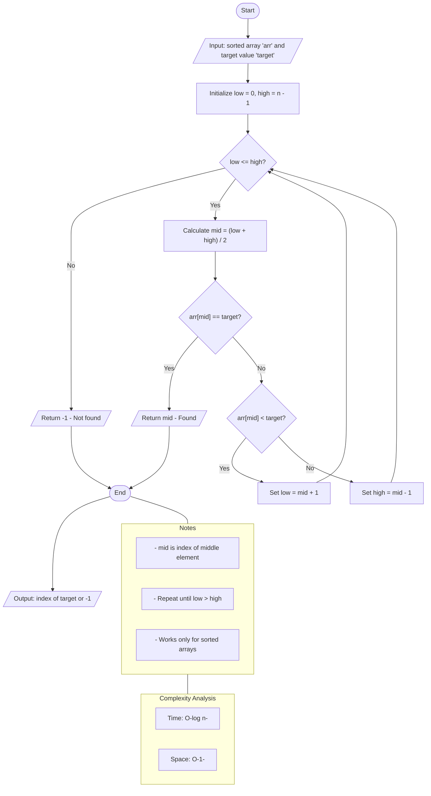

# Binary Search (Iterative Approach)

## Algorithm

Binary Search is a **Divide and Conquer** algorithm used to locate a target value within a sorted array. It operates on the principle that if the data is sorted, we can eliminate half of the remaining search space in every step by comparing the target to the middle element.

### Step-by-Step Process:

1. **Input:** A sorted array `arr` of size `n` and a `target` value.
2. **Initialize:** Set two pointers, `low = 0` and `high = n - 1`.
3. **Loop:** While `low` is less than or equal to `high`:
   * Calculate the middle index: `mid = low + (high - low) / 2`.
   * **Check Match:** If `arr[mid]` is equal to `target`, return the index `mid`.
   * **Search Right:** If `arr[mid]` is less than `target`, ignore the left half by setting `low = mid + 1`.
   * **Search Left:** If `arr[mid]` is greater than `target`, ignore the right half by setting `high = mid - 1`.
4. **Termination:** If the loop finishes without finding the target, return a value indicating the element is not present (e.g., `-1` or `None`).

---

## Pseudocode

```text
FUNCTION binarySearch(arr, target):
    low = 0
    high = length(arr) - 1

    WHILE low <= high:
        mid = low + (high - low) / 2

        IF arr[mid] == target:
            RETURN mid
        ELSE IF arr[mid] < target:
            low = mid + 1
        ELSE:
            high = mid - 1

    RETURN -1
END FUNCTION
```


### ASCII Representation

```text
       +-----------------------+
       |         Start         |
       +-----------+-----------+
                   |
         [ low=0, high=n-1 ]
                   |
    +------------->+
    |              |
    |      Is low <= high? --------+
    |              | (Yes)         | (No)
    |      +-------+-------+       |
    |      | mid = low +   |       |
    |      | (high-low)/2  |       |
    |      +-------+-------+       |
    |              |               |
    |      +-------+-------+       |
    |      | arr[mid] == T?|--Yes--+--> [ Return mid ]
    |      +-------+-------+       |
    |              | (No)          |
    |      +-------+-------+       |
    |      | arr[mid] < T? |--Yes--+--> [ low = mid + 1 ]
    |      +-------+-------+       |           |
    |              | (No)          |           |
    |      [ high = mid - 1]       |           |
    |              |               |           |
    +--------------+---------------+           |
                                               |
                                       [ Return -1 ]
```

---

## Rust Implementation

This implementation uses `Option<usize>` to represent the presence or absence of a value safely.

```rust
use std::io::{self, Write};

/// Performs an iterative binary search on a sorted slice.
/// Returns Some(index) if found, or None if not found.
fn binary_search(arr: &[i32], target: i32) -> Option<usize> {
    if arr.is_empty() {
        return None;
    }

    let mut low: isize = 0;
    let mut high: isize = (arr.len() - 1) as isize;

    while low <= high {
        // Calculate mid using this formula to prevent potential overflow
        let mid = low + (high - low) / 2;
        let mid_idx = mid as usize;

        if arr[mid_idx] == target {
            return Some(mid_idx);
        } else if arr[mid_idx] < target {
            low = mid + 1;
        } else {
            high = mid - 1;
        }
    }

    None
}

fn main() {
    let mut input = String::new();

    println!("--- Binary Search (Iterative) ---");

    print!("Enter sorted integers separated by spaces: ");
    io::stdout().flush().unwrap();
    io::stdin().read_line(&mut input).expect("Failed to read line");

    let arr: Vec<i32> = input
        .split_whitespace()
        .filter_map(|s| s.parse().ok())
        .collect();

    input.clear();
    print!("Enter the target value to search for: ");
    io::stdout().flush().unwrap();
    io::stdin().read_line(&mut input).expect("Failed to read line");

    let target: i32 = match input.trim().parse() {
        Ok(num) => num,
        Err(_) => {
            println!("Invalid target input.");
            return;
        }
    };

    match binary_search(&arr, target) {
        Some(index) => println!("Element found at index: {}", index),
        None => println!("Element not found in the array."),
    }
}
```

---

## Python Implementation

This implementation follows Python 3 best practices, including type hinting.

```python
import sys

def binary_search(arr: list[int], target: int) -> int:
    """
    Performs an iterative binary search on a sorted list.
    Returns the index of the target if found, otherwise -1.
    """
    low = 0
    high = len(arr) - 1

    while low <= high:
        # // is floor division in Python
        mid = low + (high - low) // 2

        if arr[mid] == target:
            return mid
        elif arr[mid] < target:
            low = mid + 1
        else:
            high = mid - 1

    return -1

def main():
    print("--- Binary Search (Iterative) ---")
    try:
        raw_input = input("Enter sorted integers separated by spaces: ")
        arr = [int(x) for x in raw_input.split()]
        arr.sort()  # Ensure array is sorted
        print(f"Searching in sorted array: {arr}")

        target = int(input("Enter the target value to search for: "))
        result = binary_search(arr, target)

        if result != -1:
            print(f"Element found at index: {result}")
        else:
            print("Element not found in the array.")
    except ValueError:
        print("Error: Please enter valid integers.")

if __name__ == "__main__":
    main()
```

---

## Test Cases

### 1. Example Scenarios

| Scenario            | Input Array (`arr`) | Target | Expected (Python) | Expected (Rust) |
|:------------------- |:------------------- |:------ |:----------------- |:--------------- |
| **Middle Element**  | `[1, 3, 5, 7, 9]`   | `5`    | `2`               | `Some(2)`       |
| **Left Side**       | `[1, 3, 5, 7, 9]`   | `1`    | `0`               | `Some(0)`       |
| **Right Side**      | `[1, 3, 5, 7, 9]`   | `9`    | `4`               | `Some(4)`       |
| **Missing (Small)** | `[10, 20, 30]`      | `5`    | `-1`              | `None`          |
| **Missing (Large)** | `[10, 20, 30]`      | `40`   | `-1`              | `None`          |
| **Empty Array**     | `[]`                | `10`   | `-1`              | `None`          |

### 2. Edge Cases

* **Single Element:** `arr = [10], target = 10` returns `0`.
* **Duplicates:** `arr = [1, 2, 2, 2, 3], target = 2` returns one of the valid indices (usually index `2`).
* **Negative Numbers:** `arr = [-50, -10, 0, 10, 50], target = -10` returns `1`.

### 3. Automated Python Tests

```python
import unittest

class TestBinarySearch(unittest.TestCase):
    def test_standard_cases(self):
        self.assertEqual(binary_search([1, 3, 5, 7, 9], 5), 2)
        self.assertEqual(binary_search([1, 3, 5, 7, 9], 1), 0)
        self.assertEqual(binary_search([1, 3, 5, 7, 9], 9), 4)

    def test_not_found(self):
        self.assertEqual(binary_search([1, 3, 5, 7, 9], 4), -1)
        self.assertEqual(binary_search([], 10), -1)

    def test_negative_numbers(self):
        self.assertEqual(binary_search([-10, -5, 0, 5, 10], -5), 1)

if __name__ == "__main__":
    unittest.main()
```

---

## Complexity Analysis

* **Time Complexity:**
  * **Best Case:** $O(1)$ — The target is found at the middle index on the first iteration.
  * **Average Case:** $O(\log n)$ — The search space is reduced by half in each step.
  * **Worst Case:** $O(\log n)$ — The search continues until the search space is exhausted.
* **Space Complexity:** $O(1)$ — The iterative approach uses a constant amount of extra space for pointers (`low`, `high`, `mid`), regardless of the input size.
