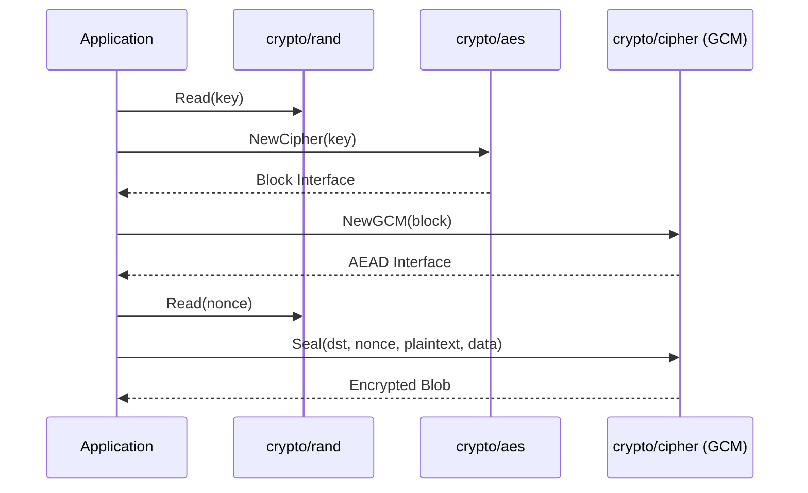

The `crypto` package in Go serves as a foundational umbrella for various cryptographic subpackages. It defines common interfaces and constants used by specific implementations like `crypto/aes` for symmetric encryption, `crypto/rsa` or `crypto/ed25519` for asymmetric operations, and `crypto/sha256` for hashing. Rather than implementing algorithms itself, the core `crypto` package establishes the standard for how signers, decrypters, and hash functions should behave, ensuring interoperability across the Go ecosystem.

2. **Pseudo-code**

```text
// High-level flow for Symmetric Encryption (AES-GCM)
1. Generate a cryptographically secure random key (32 bytes for AES-256).
2. Create a new Cipher Block (AES).
3. Wrap the block in a specific Mode (GCM - Galois/Counter Mode).
4. Generate a unique Nonce (Number used once).
5. Encrypt and Authenticate the plaintext using the Seal method.
6. Store/Transmit: [Nonce] + [Ciphertext].
```



3. **Examples**

**Example 1: Secure File Integrity Hashing (SHA-256)**
This example demonstrates how to calculate a checksum for a large file to ensure it hasn't been tampered with.

```go
package main

import (
    "crypto/sha256"
    "encoding/hex"
    "io"
    "os"
)

func ComputeFileHash(filePath string) (string, error) {
    file, err := os.Open(filePath)
    if err != nil {
        return "", err
    }
    defer file.Close()

    hash := sha256.New()
    // Use io.Copy to avoid loading the entire file into memory
    if _, err := io.Copy(hash, file); err != nil {
        return "", err
    }

    return hex.EncodeToString(hash.Sum(nil)), nil
}
```

**Example 2: Authenticated Symmetric Encryption (AES-GCM)**
This is the recommended way to encrypt sensitive data (like session tokens or PII) at rest.

```go
package main

import (
    "crypto/aes"
    "crypto/cipher"
    "crypto/rand"
    "errors"
    "io"
)

func EncryptSensitiveData(plaintext []byte, key []byte) ([]byte, error) {
    block, err := aes.NewCipher(key)
    if err != nil {
        return nil, err
    }

    gcm, err := cipher.NewGCM(block)
    if err != nil {
        return nil, err
    }

    nonce := make([]byte, gcm.NonceSize())
    if _, err := io.ReadFull(rand.Reader, nonce); err != nil {
        return nil, err
    }

    // Seal appends the ciphertext to the nonce, making it easy to store together
    return gcm.Seal(nonce, nonce, plaintext, nil), nil
}
```

**Example 3: Modern Digital Signatures (Ed25519)**
Used for signing API requests or software updates where performance and security are critical.

```go
package main

import (
    "crypto/ed25519"
    "crypto/rand"
)

func SignPayload(payload []byte) (pub ed25519.PublicKey, sig []byte, err error) {
    public, private, err := ed25519.GenerateKey(rand.Reader)
    if err != nil {
        return nil, nil, err
    }

    signature := ed25519.Sign(private, payload)
    return public, signature, nil
}

func VerifyPayload(pub ed25519.PublicKey, payload, sig []byte) bool {
    return ed25519.Verify(pub, payload, sig)
}
```

4. **Usage**
   The `crypto` package and its subpackages should be used when:
* **Protecting Data at Rest**: Encrypting database columns containing personal identification information (PII).

* **Ensuring Data Integrity**: Using HMAC or SHA-256 to verify that data has not been modified during transit.

* **Identity Verification**: Using digital signatures (RSA/ECDSA/Ed25519) to prove the origin of a message or request.

* **Secure Communications**: Implementing or configuring TLS/SSL for web servers and clients.

* **Password Management**: While `crypto` provides primitives, developers should specifically use `golang.org/x/crypto/bcrypt` or `argon2` for password hashing to prevent brute-force attacks.
5. **Similar Features**

| Signatures                | Description                                       | Usage                                                                                                       |
|:------------------------- |:------------------------------------------------- |:----------------------------------------------------------------------------------------------------------- |
| `crypto/hmac`             | Hash-based Message Authentication Code.           | Used to verify both data integrity and authenticity using a shared secret.                                  |
| `crypto/subtle`           | Functions for constant-time operations.           | Used to prevent side-channel (timing) attacks when comparing MACs or signatures.                            |
| `golang.org/x/crypto/...` | Supplementary Go cryptography packages.           | Used for non-standard or newer algorithms not yet in the main stdlib (e.g., Argon2, SSH, ChaCha20Poly1305). |
| `crypto/tls`              | Implementation of TLS (Transport Layer Security). | Used for securing network connections (HTTPS, Secure WebSockets).                                           |

6. **References**
* [Official Go Crypto Package Documentation](https://pkg.go.dev/crypto)
* [Go Cryptography Design Principles](https://go.dev/doc/security/crypto)
* [Subpackage: crypto/cipher for Block Modes](https://pkg.go.dev/crypto/cipher)
* [Subpackage: crypto/rand for Secure Randomness](https://pkg.go.dev/crypto/rand)
