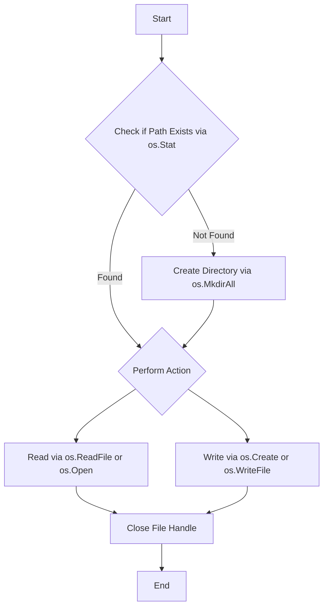

### 1. **OS package in Go 1.26**

The `os` package provides a platform-independent interface to operating system functionality, primarily focusing on file I/O, directory management, and process environment variables. The five most critical functions for standard application development are:

1. **`os.Open(name string)`**: Opens a file for reading. If the file doesn't exist, it returns an error. It returns a file descriptor (`*os.File`) which must be closed.
2. **`os.Create(name string)`**: Creates or truncates a file. If the file exists, it is wiped; if not, it is created with mode `0666`.
3. **`os.ReadFile(name string)`**: A convenience function that opens, reads the entire content into a byte slice, and closes the file in one step.
4. **`os.Stat(name string)`**: Returns `FileInfo` describing a file or directory. This is the standard way to check for file existence, size, or permissions.
5. **`os.MkdirAll(path string, perm FileMode)`**: Creates a directory and all necessary parents (like `mkdir -p`). It does nothing if the path already exists.

---

### 2. **Pseudo-code**

The following diagram represents a typical workflow for checking a file's existence, creating a directory structure if needed, and performing I/O.



```go
// High-level Logic
1. Call os.Stat(targetPath)
2. If error is fs.ErrNotExist:
    Call os.MkdirAll(parentDir, 0755)
3. To write fresh data:
    Call os.Create(targetPath) -> returns *os.File
    Write data and defer file.Close()
4. To read all at once:
    Call os.ReadFile(targetPath) -> returns []byte
```

---

### 3. **Examples**

#### A. Checking Existence and Creating Directories

This pattern is used to ensure a log or data directory exists before the application starts writing.

```go
package main

import (
    "errors"
    "fmt"
    "io/fs"
    "os"
)

func ensureDir(path string) error {
    _, err := os.Stat(path)
    if errors.Is(err, fs.ErrNotExist) {
        fmt.Printf("Path %s does not exist, creating...\n", path)
        return os.MkdirAll(path, 0750)
    }
    return err
}

func main() {
    err := ensureDir("./data/logs/app-v1")
    if err != nil {
        fmt.Fprintf(os.Stderr, "Setup failed: %v\n", err)
    }
}
```

#### B. Safe Concurrent-Safe File Writing

Using `os.Create` to initialize a file and writing structured data.

```go
package main

import (
    "encoding/json"
    "os"
)

type Config struct {
    ID    int    `json:"id"`
    State string `json:"state"`
}

func saveConfig(filename string, cfg Config) error {
    f, err := os.Create(filename)
    if err != nil {
        return err
    }
    defer f.Close() // Ensure descriptor is released

    encoder := json.NewEncoder(f)
    return encoder.Encode(cfg)
}
```

#### C. Reading Secrets or Small Assets

Using `os.ReadFile` for loading entire files like SSH keys or configuration into memory.

```go
package main

import (
    "fmt"
    "os"
    "strings"
)

func loadAPIKey(path string) (string, error) {
    data, err := os.ReadFile(path)
    if err != nil {
        return "", err
    }
    // Trim whitespace common in secret files
    return strings.TrimSpace(string(data)), nil
}
```

---

### 4. **Usage**

* **`os.Open`**: Use when processing large files (like CSVs or logs) line-by-line using a buffer (`bufio.Scanner`) to avoid high memory consumption.
* **`os.Create`**: Use for generating new reports, log files, or overwriting state files where previous content is no longer needed.
* **`os.ReadFile`**: Ideal for small files (YAML/JSON configs, TLS certificates) where the file size is known to fit comfortably in RAM.
* **`os.Stat`**: Use for validation logic, such as checking if a plugin exists or verifying file permissions before attempting an operation.
* **`os.MkdirAll`**: Standard for installers, CLI tools that need to initialize a `.config` folder, or logging systems that rotate directories by date.

---

### 5. **Similar Features**

| Signatures                       | Description                                                | Usage                                                                          |
|:-------------------------------- |:---------------------------------------------------------- |:------------------------------------------------------------------------------ |
| `os.OpenFile(name, flag, perm)`  | Low-level file opener with flags (O_APPEND, O_RDWR, etc.). | Use when you need to append to a file or have specific sync requirements.      |
| `io.ReadAll(reader)`             | Reads from any `io.Reader` until EOF.                      | Use when reading from network connections or generic streams instead of files. |
| `os.ReadDir(name)`               | Reads a directory and returns a slice of `DirEntry`.       | Use for listing files in a folder or recursive file searching.                 |
| `bufio.NewReader(file)`          | Wraps an `os.File` in a buffer.                            | Use to optimize performance when performing many small read operations.        |
| `os.WriteFile(name, data, perm)` | The counterpart to `os.ReadFile`.                          | Use for writing an entire byte slice to a file in one atomic-like operation.   |

---

### 6. **References**

* [Official Go os Package Documentation](https://pkg.go.dev/os)
* [Go by Example: Reading Files](https://gobyexample.com/reading-files)
* [Go by Example: Writing Files](https://gobyexample.com/writing-files)
* [Effective Go: Package os](https://golang.org/doc/effective_go#os)
