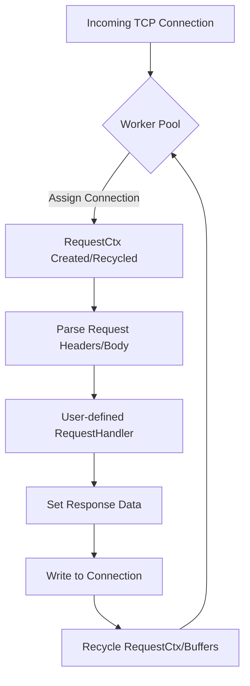

### High-Performance HTTP Implementation: `valyala/fasthttp`

The `fasthttp` package is a high-performance alternative to Go’s standard `net/http` library. While not part of the Go standard library, it is the industry 
standard for applications requiring zero memory allocations on hot paths, extremely high throughput, and low latency. It achieves this by utilizing worker p
ools, buffer recycling, and avoiding the overhead of `net/http`'s compatibility layers.

### Pseudo-code

```go
// 1. Define a RequestHandler function
func handleRequest(ctx *fasthttp.RequestCtx) {
    // 2. Access request data from the context (zero-copy)
    path := ctx.Path()

    // 3. Process logic based on method or path
    switch string(path) {
    case "/api/v1/data":
        // 4. Set response headers and body
        ctx.SetContentType("application/json")
        ctx.SetStatusCode(fasthttp.StatusOK)
        ctx.SetBody(jsonData)
    default:
        ctx.Error("Not Found", fasthttp.StatusNotFound)
    }
}

// 5. Initialize and run the server
func main() {
    fasthttp.ListenAndServe(":8080", handleRequest)
}
```

### Mermaid Diagram



### Examples

#### 1. High-Performance JSON API Server

This example demonstrates a typical API endpoint that minimizes allocations by using the `RequestCtx` and writing directly to the response buffer.

```go
package main

import (
        "encoding/json"
        "github.com/valyala/fasthttp"
)

type UserResponse struct {
        ID    int    `json:"id"`
        Email string `json:"email"`
}

func userHandler(ctx *fasthttp.RequestCtx) {
        // Only allow GET requests
        if !ctx.IsGet() {
                ctx.SetStatusCode(fasthttp.StatusMethodNotAllowed)
                return
        }

        userId := ctx.UserValue("id") // Assume set by a router
        resp := UserResponse{ID: 101, Email: "dev@example.com"}

        ctx.SetContentType("application/json")
        // Using the internal buffer to encode JSON directly to the response
        json.NewEncoder(ctx).Encode(resp)
}

func main() {
        s := &fasthttp.Server{
                Handler: userHandler,
                Name:    "HighSpeedAPI",
        }
        if err := s.ListenAndServe(":8081"); err != nil {
                panic(err)
        }
}
```

#### 2. Optimized HTTP Client with Connection Pooling

Using `fasthttp.Client` for high-concurrency scraping or proxying, utilizing request/response pooling to avoid GC pressure.

```go
package main

import (
        "fmt"
        "github.com/valyala/fasthttp"
)

var client = &fasthttp.Client{
        MaxConnsPerHost: 1000,
}

func fetchRemoteData(url string) {
        // Acquire objects from pool
        req := fasthttp.AcquireRequest()
        resp := fasthttp.AcquireResponse()
        defer fasthttp.ReleaseRequest(req)
        defer fasthttp.ReleaseResponse(resp)

        req.SetRequestURI(url)
        req.Header.SetMethod(fasthttp.MethodGet)

        if err := client.Do(req, resp); err != nil {
                fmt.Printf("Error: %s\n", err)
                return
        }

        body := resp.Body()
        fmt.Printf("Received %d bytes\n", len(body))
}
```

#### 3. Reverse Proxy Logic

`fasthttp` is frequently used to build custom edge gateways and proxies.

```go
package main

import (
        "github.com/valyala/fasthttp"
)

func proxyHandler(ctx *fasthttp.RequestCtx) {
        // Modify request headers for proxying
        ctx.Request.Header.Del("Connection")
        ctx.Request.SetHost("internal-service.local")

        // Execute proxy request
        if err := fasthttp.Do(&ctx.Request, &ctx.Response); err != nil {
                ctx.SetStatusCode(fasthttp.StatusBadGateway)
                return
        }

        // Filter or log specific response headers
        ctx.Response.Header.Set("X-Proxy-By", "Go-Fast-Proxy")
}
```

### Usage

**When to use `fasthttp`:**

* **High RPS Requirements**: When your application handles 100k+ requests per second and `net/http` becomes a CPU or memory bottleneck.
* **Low Latency Systems**: Real-time bidding (RTB) platforms, high-frequency trading (HFT) gateways, or gaming backends.
* **Resource Constrained Environments**: In edge computing or small containers where memory limits are tight; `fasthttp`'s reuse of buffers significantly 
  reduces GC frequency.
* **Reverse Proxies and Load Balancers**: Where the primary job is moving bytes between connections with minimal overhead.

**When NOT to use `fasthttp`:**

* **Standard Library Compatibility**: If you rely on the vast ecosystem of `http.Handler` middleware (like Gorilla Mux or standard `net/http` middleware).
* **HTTP/2 Support**: `fasthttp` does not support HTTP/2 natively (though there are extensions).
* **Complexity**: The API is more complex than `net/http` because it requires managing the lifecycle of requests and responses to achieve performance gain
  s.

### Similar Features

| Feature            | `net/http` (Standard Library)                     | `fasthttp`                                              |
|:------------------ |:------------------------------------------------- |:------------------------------------------------------- |
| **API Philosophy** | Clean, idiomatic, interface-based.                | Performance-first, pool-based, zero-copy.               |
| **Memory Usage**   | Higher (allocates `Request`/`Response` per call). | Minimal (reuses objects and buffers).                   |
| **HTTP/2 Support** | Native and seamless.                              | Limited (requires third-party wrappers).                |
| **Middleware**     | Huge ecosystem (Compatible with `http.Handler`).  | Smaller ecosystem; incompatible with standard handlers. |
| **Ease of Use**    | High.                                             | Medium (requires understanding of pooling/scopes).      |

### Most Used Functions and Types

| Signature/Return Types          | Description                                                   | Usage                                                  |
|:------------------------------- |:------------------------------------------------------------- |:------------------------------------------------------ |
| `type RequestCtx struct`        | The core context object containing both Request and Response. | Accessing all request data and writing responses.      |
| `type Server struct`            | The HTTP server configuration object.                         | Configuring timeouts, handler, and concurrency limits. |
| `type Client struct`            | A high-concurrency HTTP client.                               | Performing outbound requests efficiently.              |
| `AcquireRequest() *Request`     | Retrieves a `Request` object from the internal pool.          | Reducing allocations in client-side code.              |
| `ReleaseRequest(*Request)`      | Returns a `Request` object back to the pool.                  | Clean up after `AcquireRequest`.                       |
| `ListenAndServe(addr, handler)` | Shorthand for starting a server on a specific address.        | Standard server entry point.                           |
| `ctx.QueryArgs() *Args`         | Returns an object to access URL query parameters.             | Parsing `?id=123` parameters.                          |
| `ctx.PostArgs() *Args`          | Returns an object to access form-encoded POST data.           | Parsing form submissions.                              |
| `ctx.SetBody(body []byte)`      | Sets the response body.                                       | Writing the final output to the client.                |
| `ctx.UserValue(key)`            | Retrieves values stored in the context by a router.           | Retrieving path parameters like `/user/:id`.           |
| `ctx.Path() []byte`             | Returns the request path as a byte slice.                     | Routing logic based on URL.                            |
| `type Args struct`              | Represents query string or form data.                         | Manipulating key-value pairs in URLs or bodies.        |
| `type URI struct`               | Represents a parsed URI.                                      | Parsing and modifying complex URLs.                    |
| `ctx.SendFile(path)`            | Efficiently sends a file to the client using `sendfile(2)`.   | Serving static assets.                                 |
| `ctx.Response.Header.Set(k, v)` | Sets a response header.                                       | Configuring `Content-Type`, `Cache-Control`, etc.      |
| `fasthttp.Do(req, resp)`        | Executes a single HTTP request.                               | Simple client requests.                                |
| `type PipelineClient struct`    | Client that supports HTTP pipelining.                         | Extremely high throughput to a single host.            |
| `ctx.SetConnectionClose()`      | Forces the server to close the connection after response.     | Managing connection lifecycles.                        |
| `ctx.IsGet() / IsPost()`        | Helper methods to check the HTTP method.                      | Branching logic in handlers.                           |
| `ctx.Write(p []byte)`           | Implements `io.Writer` for the response body.                 | Streaming data to the client.                          |

### References

* [Official GitHub Repository](https://github.com/valyala/fasthttp)
* [Fasthttp Documentation (GoDev)](https://pkg.go.dev/github.com/valyala/fasthttp)
* [Performance Best Practices](https://github.com/valyala/fasthttp#best-practices)
* [Fasthttp vs net/http Benchmarks](https://www.techempower.com/benchmarks/)
