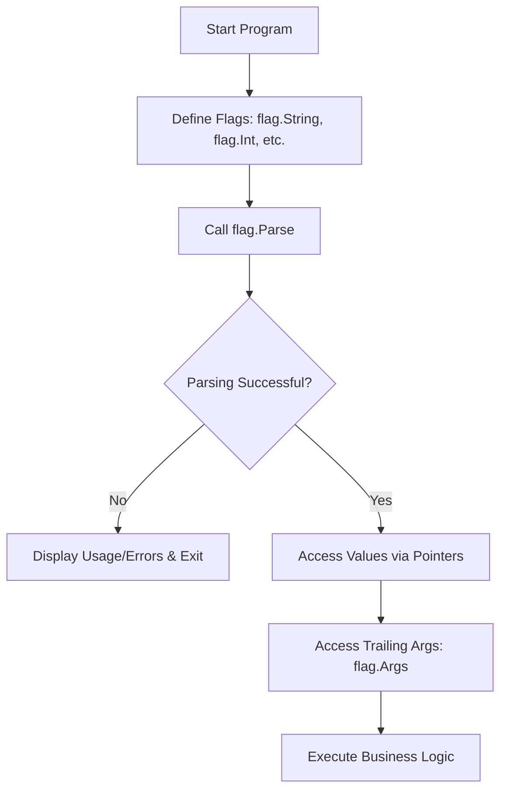

### Command-line Flag Parsing: `package flag`

The `flag` package is the Go standard library's built-in solution for parsing command-line ar
guments. It allows developers to define flags of various types (integers, strings, booleans, 
durations), provide default values, and generate automated "help" or "usage" documentation. I
t follows the Go convention where flags are prefixed with a single dash (`-flag`) or double d
ash (`--flag`), which are treated equivalently.

---

### Pseudo-code

```go
// 1. Declare variables to hold flag values
// 2. Define flags using flag.Type() or flag.TypeVar()
// 3. Optional: Customize flag.Usage for custom help text
// 4. Trigger parsing with flag.Parse()
// 5. Access values via pointers or bound variables
// 6. Handle remaining non-flag arguments via flag.Args()
```



---

### Examples

#### Basic Server Configuration

A common use case is configuring application parameters like network ports or environment mod
es.

```go
package main

import (
        "flag"
        "fmt"
        "time"
)

func main() {
        // Defining flags returns pointers to the values
        port := flag.Int("port", 8080, "Port to listen on")
        env := flag.String("env", "development", "Deployment environment (dev, staging, prod)
")
        timeout := flag.Duration("timeout", 30*time.Second, "Server read timeout")
        debug := flag.Bool("debug", false, "Enable verbose logging")

        // Must call Parse() before using the variables
        flag.Parse()

        fmt.Printf("Starting server on port: %d\n", *port)
        fmt.Printf("Environment: %s\n", *env)
        fmt.Printf("Timeout: %v\n", *timeout)
        fmt.Printf("Debug Mode: %t\n", *debug)
}
```

#### Custom Flag Types (The `Value` Interface)

If you need to parse complex data structures like comma-separated slices, you can implement t
he `flag.Value` interface.

```go
package main

import (
        "flag"
        "fmt"
        "strings"
)

// StringSlice implements the flag.Value interface
type StringSlice []string

func (s *StringSlice) String() string {
        return strings.Join(*s, ",")
}

func (s *StringSlice) Set(value string) error {
        *s = append(*s, strings.Split(value, ",")...)
        return nil
}

func main() {
        var allowedOrigins StringSlice
        // flag.Var allows binding custom types that satisfy the flag.Value interface
        flag.Var(&allowedOrigins, "origins", "Comma-separated list of allowed CORS origins")

        flag.Parse()

        for i, origin := range allowedOrigins {
                fmt.Printf("Origin %d: %s\n", i+1, origin)
        }
}
```

---

### Usage

The `flag` package is used to:

1. **Configure Applications**: Set database URLs, API keys, or port numbers at runtime.
2. **Toggle Features**: Use boolean flags to enable/disable specific code paths (e.g., `--dr
   y-run`).
3. **Generate Documentation**: Automatically provides a `-h` or `--help` flag for users.
4. **Flexible Inputs**: Handle durations (e.g., `5s`, `1h`) and custom types natively.

Use this package when you need a lightweight, zero-dependency way to handle input parameters 
for CLI tools or backend services.

---

### Similar Features

| Signatures                                                                | Description                                                      | Usage           |
|:------------------------------------------------------------------------- |:---------------------------------------------------------------- |:--------------- |
| `os.Args`                                                                 | A slice of strings containing the raw command-line arguments.    | Use for extreme |
| `github.com/spf13/pflag`                                                  | A drop-in replacement for `flag` that supports POSIX/GNU-style f |                 |
| `github.com/spf13/cobra`                                                  | A powerful library for building modern CLI applications with sub |                 |
| commands (e.g., `git clone`).                                             | Use for complex CLI tools with nested commands and nested fla    |                 |
| gs.                                                                       |                                                                  |                 |
| `github.com/urfave/cli`                                                   | A declarative framework for building command-line apps.          | Use for         |
| mid-to-large CLI tools that prefer a struct-based configuration approach. |                                                                  |                 |

---

### References

* [Official Go `flag` Documentation](https://pkg.go.dev/flag)
* [Go by Example: Command-Line Flags](https://gobyexample.com/command-line-flags)
* [Effective Go: Flag parsing](https://golang.org/doc/effective_go#flags)
