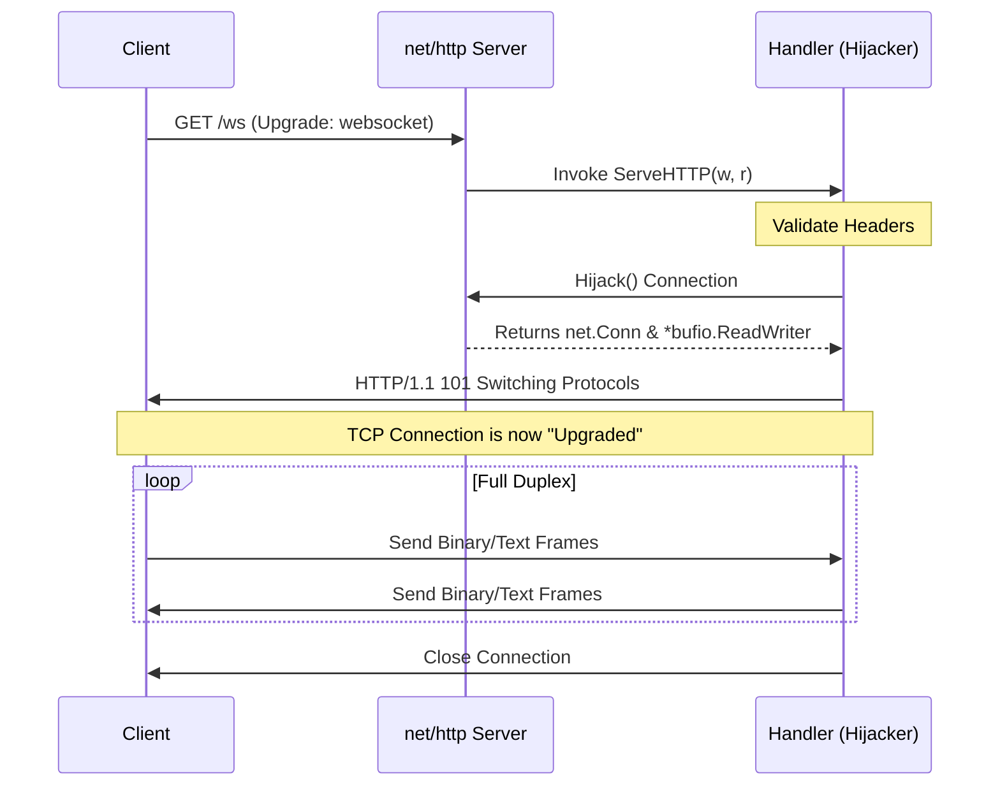

### HTTP Server and WebSocket Upgrading (net/http)

The `net/http` package provides HTTP client and server implementations. For WebSockets, while the standard library does not provide a high-level WebSocket f
rame parser, it provides the fundamental `http.Hijacker` interface. This interface allows a handler to take over the underlying TCP connection from the HTTP
 server, which is the prerequisite for "upgrading" an HTTP connection to the WebSocket protocol.

---

### Pseudo-code

```go
// 1. Define a multiplexer (router)
mux := http.NewServeMux()

// 2. Register standard HTTP handlers
mux.HandleFunc("/api/data", handleData)

// 3. Register a WebSocket upgrade handler
mux.HandleFunc("/ws", func(w http.ResponseWriter, r *http.Request) {
    // Validate request (Headers, Method, Origin)
    // Check if ResponseWriter supports Hijacking
    hj, ok := w.(http.Hijacker)

    // Hijack the TCP connection
    conn, bufrw, err := hj.Hijack()
    defer conn.Close()

    // Send HTTP 101 Switching Protocols response manually
    bufrw.WriteString("HTTP/1.1 101 Switching Protocols\r\n")
    bufrw.WriteString("Upgrade: websocket\r\n")
    bufrw.WriteString("Connection: Upgrade\r\n\r\n")
    bufrw.Flush()

    // Enter full-duplex communication loop
    for {
        // Read/Write raw bytes according to RFC 6455
    }
})

// 4. Configure and start the server
server := &http.Server{Addr: ":8080", Handler: mux}
server.ListenAndServe()
```

---

### Mermaid Flow Diagram



---

### Examples

#### 1. Production-Grade HTTP Server with Timeouts

This example demonstrates setting up a robust HTTP server using `net/http` with proper timeout configurations to prevent resource exhaustion.

```go
package main

import (
        "context"
        "net/http"
        "time"
)

func main() {
        mux := http.NewServeMux()

        // Registering a handler
        mux.HandleFunc("GET /health", func(w http.ResponseWriter, r *http.Request) {
                w.Header().Set("Content-Type", "application/json")
                w.WriteHeader(http.StatusOK)
                w.Write([]byte(`{"status":"ok"}`))
        })

        server := &http.Server{
                Addr:         ":8080",
                Handler:      mux,
                ReadTimeout:  5 * time.Second,
                WriteTimeout: 10 * time.Second,
                IdleTimeout:  120 * time.Second,
        }

        // In a real app, use signal.Notify to trigger server.Shutdown(ctx)
        server.ListenAndServe()
}
```

#### 2. Manual WebSocket Upgrade via Hijacking

Since `net/http` doesn't parse WebSocket frames, this snippet shows how to perform the handshake. (In production, one would typically use a library like `nh
ooyr.io/websocket` which wraps this logic).

```go
package main

import (
        "bufio"
        "fmt"
        "net/http"
)

func wsHandler(w http.ResponseWriter, r *http.Request) {
        // Verify the Upgrade header
        if r.Header.Get("Upgrade") != "websocket" {
                http.Error(w, "Expected websocket upgrade", http.StatusBadRequest)
                return
        }

        // Type assert to http.Hijacker
        hj, ok := w.(http.Hijacker)
        if !ok {
                http.Error(w, "Webserver doesn't support hijacking", http.StatusInternalServerError)
                return
        }

        // Take control of the connection
        conn, bufrw, err := hj.Hijack()
        if err != nil {
                http.Error(w, err.Error(), http.StatusInternalServerError)
                return
        }
        defer conn.Close()

        // Perform Handshake (simplified - missing Sec-WebSocket-Accept calculation)
        bufrw.WriteString("HTTP/1.1 101 Switching Protocols\r\n")
        bufrw.WriteString("Upgrade: websocket\r\n")
        bufrw.WriteString("Connection: Upgrade\r\n\r\n")
        bufrw.Flush()

        // Start reading raw data (this will be encoded in WebSocket frames)
        data, _, _ := bufrw.ReadLine()
        fmt.Printf("Received raw frame data: %s\n", string(data))
}
```

---

### Usage

**When to use `net/http`:**

- **REST APIs**: Building standard JSON/XML web services.
- **Static File Serving**: Using `http.FileServer` to serve assets.
- **Middleware**: Implementing authentication, logging, or rate limiting via the `http.Handler` interface.

**When to use `http.Hijacker` (for WebSockets):**

- **Protocol Switching**: When you need to transition from HTTP to a different protocol (like WebSockets, gRPC, or a custom binary protocol) over the same p
  ort.
- **Real-time Communication**: Use as the foundation for chat apps, live dashboards, or gaming servers.
- **Custom Proxying**: Implementing low-level reverse proxies that require direct TCP stream manipulation.

---

### Similar Features

| Signatures                  | Description                                                    | Usage                                                                     |
|:--------------------------- |:-------------------------------------------------------------- |:------------------------------------------------------------------------- |
| `http.Handler`              | An interface with `ServeHTTP(ResponseWriter, *Request)`.       | The primary interface for all web logic in Go.                            |
| `http.Hijacker`             | An interface to take over the connection from the HTTP server. | Essential for WebSockets and custom protocol upgrades.                    |
| `http.Pusher`               | An interface for HTTP/2 Server Push.                           | Used to proactively send resources to a client before they are requested. |
| `httptest.ResponseRecorder` | An implementation of `ResponseWriter` for unit tests.          | Used to capture the output of a handler for assertions in tests.          |

---

### References

- [Go net/http Documentation](https://pkg.go.dev/net/http)
- [Go http.Hijacker Interface](https://pkg.go.dev/net/http#Hijacker)
- [RFC 6455 - The WebSocket Protocol](https://datatracker.ietf.org/doc/html/rfc6455)
- [Build a Web Server - Go Dev Tutorial](https://go.dev/doc/articles/wiki/)
